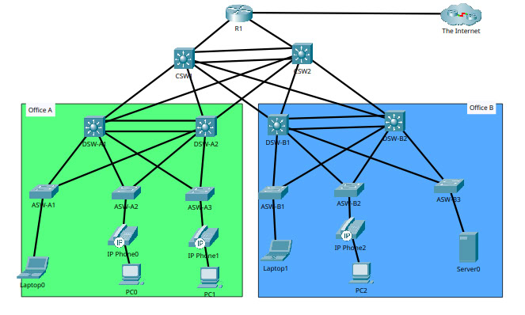

# CCNA Mega Lab

## Topology

## Project Overview

This project is a comprehensive CCNA-level lab designed to simulate an enterprise network across two offices. It integrates multiple Layer 2 and Layer 3 technologies along with network services and security features.

Technologies covered include VLANs, multilayer switching, trunking, VTP, spanning tree (RSTP, PortFast, BPDU Guard), EtherChannel (Layer 2 and Layer 3), static and dynamic routing (OSPF), IPv6, ACLs, NAT, DHCP, DNS, Syslog, SSH, FTP, and network security mechanisms.

## Network Design

The network is divided into two offices (Office A and Office B) using a hierarchical design:
- Access layer (end devices)
- Distribution layer (multilayer switches)
- Core layer (core switches)
- Router for external connectivity

![Insert logical diagram screenshot]

## VLAN Design
### Office A
- VLAN 10: PCs
- VLAN 20: Voice
- VLAN 99: Management
### Office B
- VLAN 10: PCs
- VLAN 20: Voice
- VLAN 30: Servers
- VLAN 99: Management
VLANs are used to segment the network for better organization, performance, and security.

![Insert VLAN table screenshot]

## Multilayer Switching
Multilayer switches at the distribution layer handle inter-VLAN routing and act as the default gateway for all VLANs using SVIs.
This allows devices in different VLANs to communicate without relying on an external router.

![Insert SVI configuration screenshot]
![Insert routing table screenshot]
# Layer 2 Technologies

## Trunk Links

Trunk links are configured between access and distribution switches, allowing all VLANs to traverse a single link.

## VTP

VTP is configured with DSW1 as the server in both offices to propagate VLAN configurations across switches.

## Spanning Tree (RSTP)

Rapid Spanning Tree Protocol is used to prevent Layer 2 loops. DSW1 is configured as the root bridge in both offices.

## PortFast and BPDU Guard
- **PortFast** is enabled on access ports for faster device connectivity.
- **BPDU Guard** is enabled to prevent rogue switches from affecting the topology.

## EtherChannel
- **Layer 2 EtherChannel:** between distribution switches.
- **Layer 3 EtherChannel:** between core switches.
- EtherChannel improves bandwidth and provides redundancy.

![EtherChannel screenshot]
![STP root bridge screenshot]

# Routing

## Static Routing
A static default route is configured to handle unknown destinations.

## Dynamic Routing (OSPF)
OSPF is enabled across:
- Distribution switches
- Core switches
- Router
This allows automatic route exchange and scalability.

![OSPF neighbors screenshot]
![Routing table screenshot]

## IPv6
IPv6 addressing and routing are configured on the router and core switches to demonstrate dual-stack networking.

![IPv6 routing screenshot]

# Security

## Layer 2 Security 
### Port Security 
Configured on access ports to restrict unauthorized devices based on MAC addresses.
### DHCP Snooping 
Prevents rogue DHCP servers and includes rate limiting to mitigate DHCP starvation attacks.
### Dynamic ARP Inspection 
Protects against ARP spoofing and poisoning attacks.
 
![Port security screenshot]
 
## Layer 3 Security 
### Extended ACLs 
to control traffic between networks. Example: ICMP (ping) from Office A PCs to Office B PCs is denied. All other traffic is allowed.
 
d![ACL config screenshot]
d![Ping test screenshot]
 
# Network Services 
### DHCP 
rRouter1 acts as the DHCP server. Address pools are created for all VLANs. First 10 addresses in each subnet are reserved. Distribution switches act as DHCP relay agents.
### DNS 
a DNS server is configured in VLAN 30 (Office B) with A records and a CNAME for testing.
### Syslog 
device send log messages to the Syslog server located in VLAN 30 (Office B).
d!Insert screenshots where indicated.
# Remote Access and File Transfer

## SSH

SSH is configured on all devices and restricted to PCs in VLAN 10 (Office A).

## FTP

An FTP server in VLAN 30 is used to transfer IOS images to Router1.

![Insert SSH access screenshot]

![Insert FTP transfer screenshot]

## NAT

### Static NAT
Maps an internal server address to a public IP address.

### Dynamic NAT (PAT)
Allows multiple internal devices to share a limited number of public IP addresses using port translation.

![Insert NAT table screenshot]
